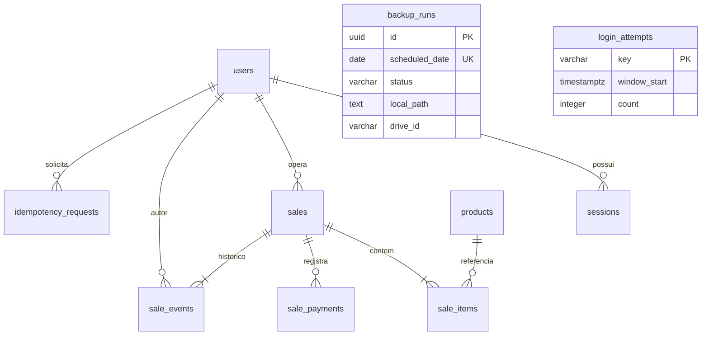

# Modelo da loja local

Uma loja por instalação. PostgreSQL é a única fonte operacional; não existe importação automática do navegador. O bot Telegram não usa esta API nem recebe credenciais do banco.

## Dicionário

Todos os `id` são UUID, exceto as chaves compostas/contadores indicados. `created_at`, `updated_at`, `expires_at`, `generated_at`, `uploaded_at`, `window_start` e `next_attempt_at` são `timestamptz`. Datas são geradas pelo servidor, exibidas em America/Sao_Paulo. `scheduled_date` é uma data civil nesse fuso. Colunas são obrigatórias salvo indicação de opcionalidade.

| Tabela | Campos e semântica |
|---|---|
| users | id; login varchar(80) único normalizado para minúsculas; name varchar(200); password_hash text Argon2id; role admin/operator; active boolean; version integer >0; created_at/updated_at. |
| sessions | id; user_id FK; token_hash varchar(64) SHA-256 único (token original só no cookie); csrf_token varchar(80); expires_at; revoked boolean; created_at. |
| products | id; code varchar(100) único; barcode varchar(100) opcional único (EAN cadastral); name varchar(300); price_cents bigint; stock numeric(16,3) informativo, admite saldo negativo; active; version >0; created_at/updated_at. |
| sales | id; number bigint identity único (pode haver lacunas após rollback); status completed/cancelled; subtotal_cents/discount_cents/total_cents bigint; notes text; edited boolean; version >0; created_by/updated_by FKs users; created_at/updated_at. |
| sale_items | id; sale_id/product_id FKs; position integer único dentro da venda; quantity integer positivo; name/code/barcode (opcional)/unit_price_cents são cópias da operação; created_at. |
| sale_payments | id; sale_id FK; position único na venda; method pix/credit/debit/cash; applied_cents/received_cents/change_cents bigint; created_at. |
| sale_events | id; sale_id/actor_id FKs; type created/edited/cancelled/reactivated; before JSONB opcional na criação; after JSONB obrigatório; created_at. Snapshots completos da venda, sem senhas/tokens. |
| idempotency_requests | PK(user_id, key UUID); request_hash SHA-256 do JSON normalizado; result JSONB da resposta original; created_at. Sem expiração automática para não duplicar pedidos antigos. |
| backup_runs | id; scheduled_date opcional único; status queued/generating/pending/uploaded/failed/archived; created_at; generated_at/uploaded_at opcionais; checksum SHA-256 opcional; local_path/drive_id/error/upload_uri/next_attempt_at opcionais. URL de envio protegida, não exposta na API. |
| login_attempts | key SHA-256 do escopo login/IP; window_start; count. Limitação compartilhada entre processos/reinícios. |

## Integridade e permissões

Valores monetários entre zero e 9.007.199.254.740.991 centavos, preservando a precisão do JavaScript. Parcelas estritamente positivas; quantidade inteira de 1 a 1.000.000 na API. Desconto ≤ subtotal. Um índice parcial permite somente uma parcela em dinheiro. Não dinheiro exige recebido=aplicado e troco=0.

Triggers de restrição diferidos conferem, ao COMMIT, a soma dos itens, a existência de itens e a soma das parcelas. Venda gratuita aceita pagamentos vazios. Uma falha reverte venda, itens, pagamentos, evento e idempotência. FKs usam RESTRICT; os endpoints inativam usuários/produtos e não oferecem exclusão física. Nenhum serviço de venda grava `products.stock`.

O papel `pdv_api` não recebe UPDATE, DELETE ou TRUNCATE em sale_events. Trigger também recusa atualização/exclusão de eventos. Isso protege contra alterações pela aplicação, **não contra o proprietário/superusuário do banco ou administrador da máquina**. Históricos antigos de localStorage não são reconstruídos nem importados.

`pdv_backup` lê dados e atualiza somente backup_runs. `pdv_owner` é usado na inicialização e em migrações administrativas, nunca pelo servidor HTTP. Não compartilhar essas credenciais. Migrações executam antes da API e reaplicam grants explícitos.

## Concorrência e transições

A prévia usa preços/versionamento atuais e gera uma assinatura. Na criação, os produtos são bloqueados em ordem de UUID, a prévia é recalculada e a assinatura deve coincidir. Mudança retorna 409 para nova confirmação.

A criação bloqueia a combinação usuário/chave de idempotência. Repetição de corpo idêntico retorna a resposta original, inclusive após perda da resposta; corpo diferente retorna 409. Edições e transições bloqueiam a venda e exigem sua versão. Concluída editada exibe Alterada; cancelamento preserva `edited`; reativação preserva a mesma indicação. Cancelar não estorna valores bancários.

Migrações: `d8f9e685f9ae` cria estrutura; `e239_integrity` instala restrições agregadas e histórico; `e240_backup_outbox` acrescenta retomada de envio e estado de restauração. Downgrade é ferramenta de desenvolvimento, não procedimento de recuperação operacional.
